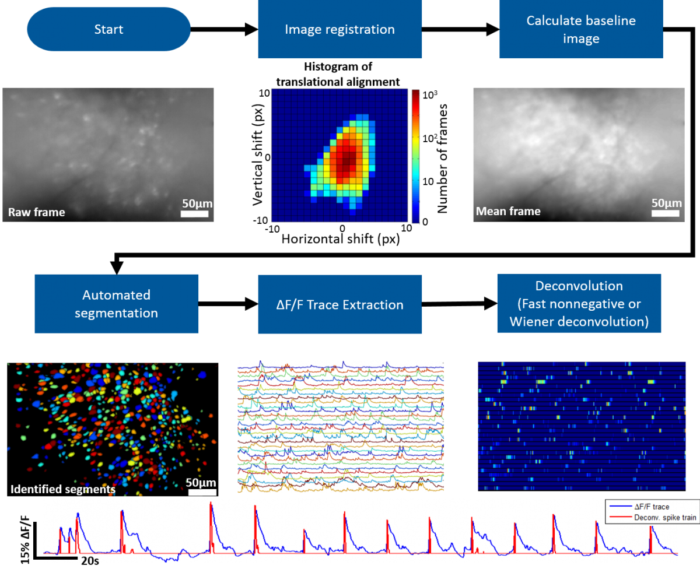

# Modeling of neural activity using deep neural networks
Deep neural networks are postulated to breakthrough improved performance via learning of high-order features, however limited data and knowledge of _a prior_ structure complicate application to the study of neural activity. Here, I apply SOTA deep neural networks to brain-wide, single neuron recordings enabled by advances in electrophysiology technology to assess considerations for appropriate application and interpretation of results. 

## Decoding decision-making behavior from neural activity

This is a comparison of statistical models vs. deep neural networks (DNNs), their performances across different conditions and with various hyperparameters and types of neural data enabled by recent advances in cellular-resolution, brain-wide imaging.
### see "DNN_decoding.ipynb"
- Summary excerpted here. See notebook for additional details

### Hypotheses:
1. Decision-making behavior can be predicted reasonably well from information encoded in neural activity, even with small datasets
2. DNNs outperform statistical models but are prone to overfitting and require additional considerations, e.g. regularization

### Procedures:
1. Simulate neural data as validation of models to be used later with more complicated real neural data
2. Apply logistic regression
3. Apply recurrent neural networks (RNNs), LSTM, and XGBoost
4. Compare DNNs to logistic regression
5. Experimentation with optimizing hyperparameters

### Results & Conclusions summary:
- Early evidence that complicated decision-making behavior can be predicted from information encoded in neural activity, and that multi-regional coordination is involved
- XGBoost appears to be the best performing (67% accuracy vs. 30% expected by chance). Don't want to overinterpret results biologically via differential DNN architectures, but, speculatively, if XGB outperforms it may suggest that time dependencies and hidden states may play a less important role in brain-wide dynamics.
- Alternatively, this could also be due to simply the nature of dataset with sparse spikes (to address this, can conduct analysis on a different type of data, such as EEG or calcium imaging), or model assumptions regarding this data more appropriate
- Unclear whether other DNNs outperform
- Interestingly, this suggests cellular information integrated across brain regions may work together for decision-making, a phenomenon that was previously technologically inaccessible

## Testing Transformers on neural activity construed as tokenized language sequences
### ongoing work, see "neural-sequence_transformers_v2.ipynb"

### summary:
- motivation:
  - neuroscience lacks ways of flexibly modeling both global and local modulation of neural activity, lacks accucracy on real-time, and models are computationally inefficient e.g. for BCI applications
  - ML research on sequence models would benefit from extension of transformer architecture into other domains, testing of its embeddings to capture meaningful features of neural activity, as proof-of-concept for a generalized architecture
- framework:
  - neural activity may be construed as a sequence analogous to a text sequence
  - will first utilize data structure from language sentiment classification analysis to test training implementation. Then, will convert and reformat data structure of neural activity to resemble that of language data. Time bins for neural activity spikes can be analogous to tokenized vocab. Then will train analogously to model behavioral decisions in mice
- initial results:
  - suggest that bins of neural activity spikes construed as tokenized sequences analogous to language modeling is amenable to transformer architecture. 47% initial accuracy vs. 33% expected by chance. Interestingly, this may already outperform RNN and LSTM models (around 30%, as in "DNN_decoding.ipynb") despite a fraction of training data utilized
  - further validation required. 

## Spike deconvolution from calcium imaging data is ongoing, with goal to apply similar analysis as above.
Representative diagram of calcium imaging signal extraction process:

 
from from miniscope.org